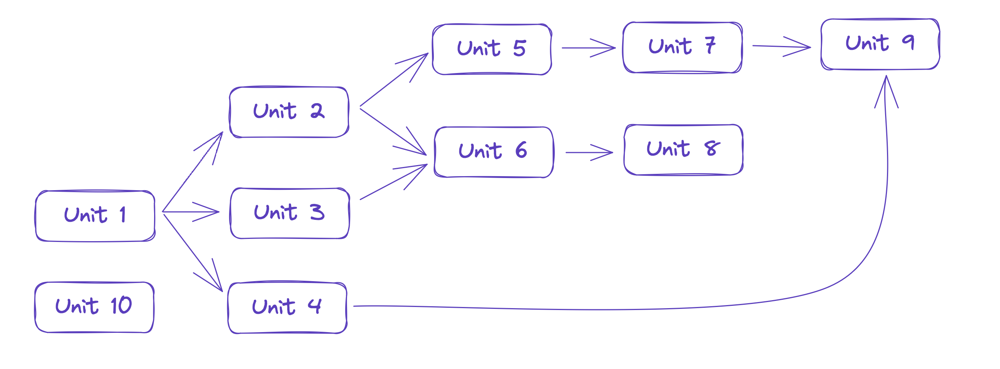

# Основная идея

Проект GodFather направлен на унификацию создания ботов для различных мессенджеров сетей.

## Юнит

Базовая сущность фреймворка. Юнит содержит в себе различные лямба выражения, которые встраиваются в процесс обработки сообщений. Именно в написании этих лямбд и заключается основная работа с библиотекой.

Есть несколько разных типов юнитов, подробнее о каждом читайте в отдельном разделе.

Юнит представляет собой некую конфигурацию, которая передается в обработчик юнита. У каждого типа юнита есть свой обработчик. 

Юниты могут образовывать связный список, тем самым определяя дерево сценарий бота.

## Сценарий

Для понимания рассмотрим небольшой пример по схеме изображенной ниже. Так же небольшие примеры обработки есть в тестах.

{ loading=lazy align=left }

Сценариями в данном случае являются:

* Unit1 —> Unit2 —> Unit5 —> Unit7 —> Unit9
* Unit1 —> Unit2 —> Unit6 —> Unit8;
* Unit1 —> Unit3 —> Unit6 —> Unit8;
* Unit1 —> Unit4 —> Unit9;
* Unit10.

Пользователь присылает боту свое первое сообщение, например, «Привет». Если сообщение удовлетворяет регулярному выражению или содержит необходимое количество ключевых слов Unit1, то возвращается Unit1, то же самое относится к Unit10.

Если оба юнита удовлетворяют запросу пользователя, то будет возвращен юнит с большим приоритетом (поле priority). Если приоритеты равны, то случайный Unit.

В нашем примере, на первое сообщение, пользователь получил Unit1, поэтому следующее сообщение пользователя будет ассоциироваться с множеством: Unit2, Unit3 и Unit4.

## Механизм выбора юнита

Пока сценарий линейный никакой необходимости в определении юнита нет. Однако, когда у вас на одном уровне находится несколько юнитов, то возникает необходимость выбрать юнит для последующей обработки сообщений. (1)
{ .annotate }

1. Обратимся к предыдущей схеме сценария. Как выбрать какой юнит обработать после обработки Unit 1?

Юниты обладают триггерами, которые сигнализируют о том, что данный юнит может обработать запрос от пользователя. 

Механизм выбора можно описать несколькими этапами:

* Сначала проверяются триггеры у всех юнитов.
* Все юниты, триггеры которых сработали, являются потенциальными кандидатами на обработку
* Из этих юнитов выбирается юнит с наибольшим приоритетом. Если у них одинаковый приоритет, то выбирается случайный юнит.

Но как выбираются первые юниты (1) для обработки? В начале сценария стоят main юниты. Именно main юниты участвуют в первом раунде выбора обработчика. Чтобы создать main юнит, необходимо в аннотации `@Unit` установить параметр `main = true`.
{ .annotate }

1. На схеме это Unit 1 и Unit 2

Также существуют так называемые глобальные юниты, которые участвуют в каждом раунде выбора. Чтобы создать глобальный unit, необходимо в аннотации `@Unit` установить параметр `global = true`.

